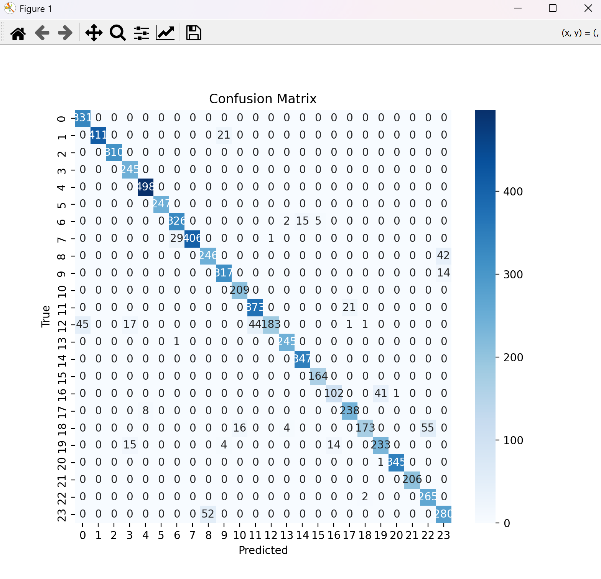

# 🧠 Sign Language Recognition using Deep Learning

This project implements a deep learning model to recognize American Sign Language (ASL) alphabets using image data from the **Sign Language MNIST** dataset. The trained model achieves over **93% accuracy**, and includes training, evaluation, and visualization components.

## 📌 Project Structure

```
📁 Sign Language/
│
├── data/
│ ├── sign_mnist_train.csv
│ └── sign_mnist_test.csv
├── Images/
  ├── amer_sign2.png
  ├── amer_sign3.png
  ├── american_sign_language.PNG
  ├── Classification Report.png
  ├── Heatmap.png
├── src/
  ├── __pycache__
     ├──model.cpython-311.pyc
     ├──preprocess.cpython-311.pyc
  ├── preprocess.py
  ├── model.py
  ├── train.py
  ├── evaluate.py
└── README.md 
├── requirements.txt         
└── sign_language_model.h5          
```

---


## 📚 Dataset

- **Source**: Kaggle [Sign Language MNIST](https://www.kaggle.com/datamunge/sign-language-mnist)
- **Classes**: 24 alphabets (A-Y excluding J and Z)
- **Format**: CSV (each row is a flattened 28x28 grayscale image)

---

## 🚀 Model Overview

- **Architecture**: Convolutional Neural Network (CNN)
- **Framework**: TensorFlow & Keras
- **Input**: 28x28 grayscale images
- **Output**: 24 softmax classes (0–25, excluding 9 and 25 for 'J' and 'Z')

---

## 🔧 Setup Instructions

1. **Clone Repository**
   ```bash
   git clone https://github.com/your-username/sign-language-recognition.git
   cd sign-language-recognition

2. **Install dependencies**
   ```bash
   pip install -r requirements.txt

   ```
3. **📊 Data Preprocessing**
   ```bash
   python src/preprocess.py
   ```
4. **🧠 Model Architecture**
   ```bash
   python src/model.py
   ```
5. **🏋️‍♂️ Model Training**
   ```bash
   python src/train.py
   ```
6. **📈 Evaluate the Model**
   ```bash
   python src/evaluate.py
   ```
## 📈 Evaluation Results


- 🔍Test Accuracy: 93%

- 🌐Classification Report:
    - High precision and recall across most classes
    - Weighted Avg F1-Score: 0.93
    - Report : 

- Confusion Matrix Example : 

---
## 💡 Future Enhancements

 - 📸 Real-time sign recognition using webcam and OpenCV

 - 🌐 Streamlit/Flask Web App for interactive use

 - 📦 Export model as .tflite or ONNX for mobile deployment

 - 🗣️ Add voice-over for predicted letters

---

## ✍️ Author

**Shreya Balasubramani**

*3rd Year BTech CSE Student*

---

## 📄 License


This project is licensed under the MIT License - see the LICENSE file for details.
